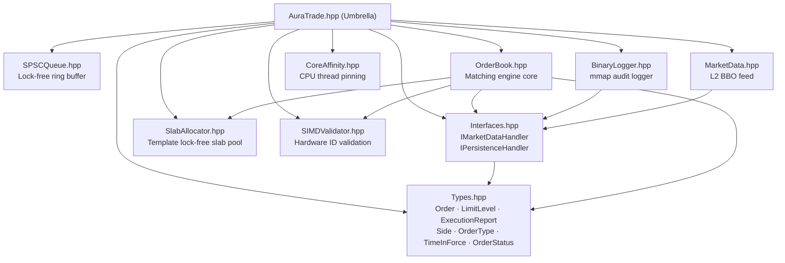
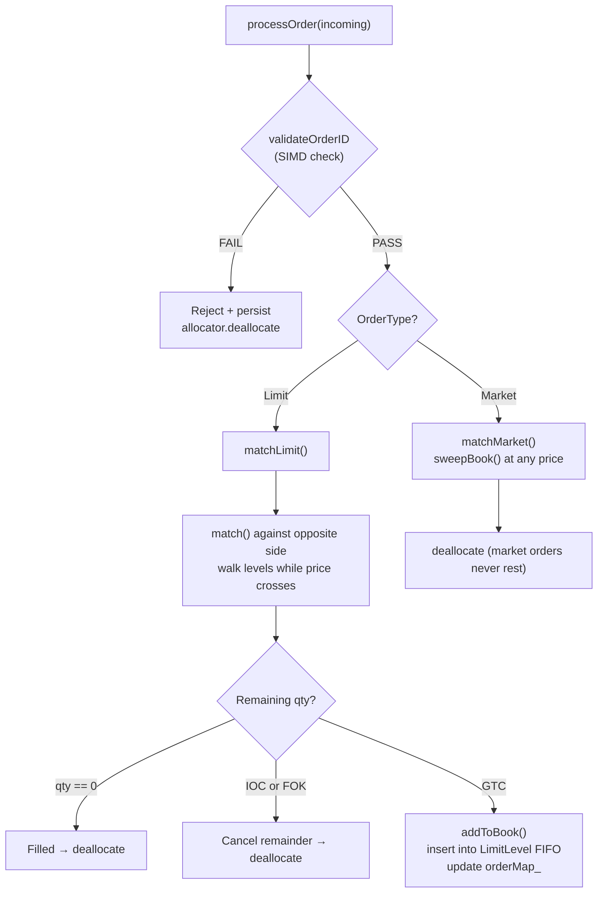
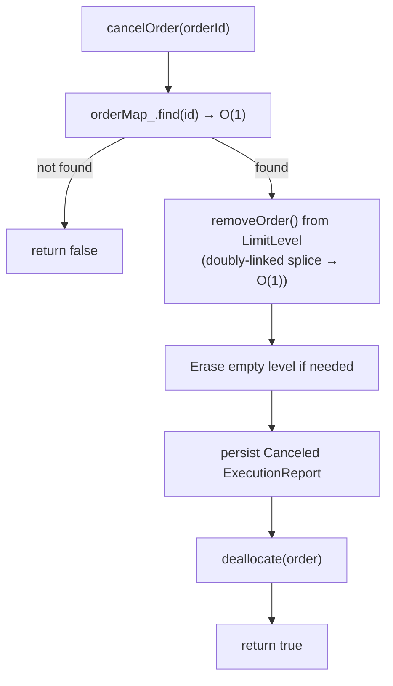
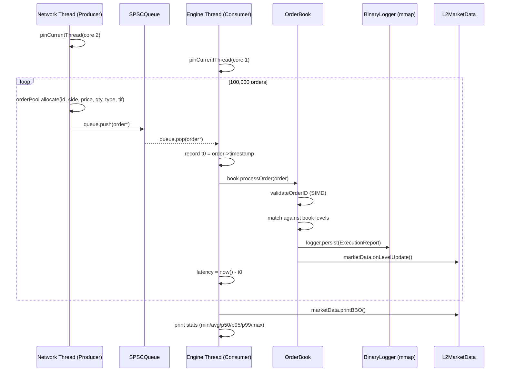
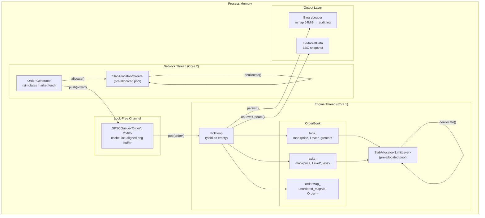

# Aura-Trade — Technical Deep Dive

> A production-grade, sub-microsecond Limit Order Book matching engine in C++20.
> This document explains every file, every design decision, and the complete runtime flow.

---

## 1. What Is a Matching Engine?

A **Matching Engine** is the core of any exchange (stock market, crypto exchange, etc).
Its job is simple: receive buy and sell orders, and when a buyer's price meets a seller's price — **match them**.

| Concept | Description |
|---|---|
| **Order** | A request to buy or sell a quantity at a specific price |
| **Limit Order** | Match only at the specified price or better |
| **Market Order** | Match immediately at whatever price is available |
| **Order Book** | Two lists: all resting buy orders (bids) and resting sell orders (asks) |
| **Match** | When a bid price ≥ ask price → a trade is executed |
| **Tick-to-Trade** | Time elapsed from order arrival → trade execution |

---

## 2. Project File Map

```
AuraTrade/
├── include/AuraTrade/
│   ├── AuraTrade.hpp       ← #1 Umbrella: include this in user code
│   ├── Types.hpp           ← #2 All shared data structures & enums
│   ├── Interfaces.hpp      ← #3 Abstract contracts (SOLID: ISP, DIP)
│   ├── SlabAllocator.hpp   ← #4 Zero-allocation memory pool
│   ├── SPSCQueue.hpp       ← #5 Lock-free inter-thread channel
│   ├── OrderBook.hpp       ← #6 THE matching engine
│   ├── BinaryLogger.hpp    ← #7 mmap-backed audit persistence
│   ├── MarketData.hpp      ← #8 L2 best-bid/offer feed
│   ├── CoreAffinity.hpp    ← #9 CPU thread pinning
│   └── SIMDValidator.hpp   ← #10 Hardware order-ID validation
├── main.cpp                ← #11 Benchmark driver (producer + engine threads)
├── Makefile                ← #12 Build system
├── .gitignore
└── README.md
```

---

## 3. Component Dependency Graph



---

## 4. File-by-File Breakdown

### `Types.hpp` — The Data Layer

Defines every shared plain-data struct and enum. **No logic, no dependencies.**

```
Side        → Buy | Sell
OrderType   → Limit | Market
TimeInForce → GTC | IOC | FOK
OrderStatus → New | PartiallyFilled | Filled | Canceled | Rejected

Order       → intrusive doubly-linked node
              (next/prev used by LimitLevel queue AND SlabAllocator free-list)

LimitLevel  → FIFO queue of orders at one price point
              (head/tail pointers, O(1) push-back / O(1) splice-out)

ExecutionReport → POD struct written to the binary audit log
```

> **Key design**: `Order::next` serves dual purpose — it is the free-list pointer
> when an order is in the slab pool, and the "next order at this price" pointer
> when it is resting in the book. This avoids a separate list-node allocation.

---

### `Interfaces.hpp` — Abstractions (SOLID: ISP + DIP)

Two pure-virtual contracts that `OrderBook` depends on **by interface, not by implementation**.

```cpp
IMarketDataHandler  onTrade()       → called on every fill
                    onLevelUpdate() → called whenever a price level changes qty

IPersistenceHandler persist()       → called to write every ExecutionReport to disk
```

This means you can swap `BinaryLogger` for a Kafka producer, or `L2MarketData`
for a FIX-protocol feed, **without touching OrderBook at all**.

---

### `SlabAllocator.hpp` — Zero-Allocation Memory Pool

```
Problem: new/delete on the hot path causes heap lock contention + cache misses.
Solution: Pre-allocate N objects at startup. Hand them out in O(1) via a CAS free-list.
```

**Internals:**


- `allocate()` — CAS the head off the free-list, call `reset()` on the object
- `deallocate()` — CAS the object back onto the head of the free-list
- `alignas(64)` on the atomic pointer → prevents false sharing with other cache lines

**Thread Safety:** Full CAS loop → safe for multiple concurrent callers.

---

### `SPSCQueue.hpp` — Lock-Free Inter-Thread Channel

```
Problem: std::queue + mutex between producer and consumer = microseconds of lock overhead.
Solution: Ring buffer with two independently-owned atomic indices.
```

```
 Producer (network thread)          Consumer (engine thread)
 owns head_ exclusively             owns tail_ exclusively

 [  ][  ][  ][  ][ X ][ X ][ X ]
  ^tail_                     ^head_
              ←── unread ───→
```

- `head_` and `tail_` are on **separate 64-byte cache lines** (`alignas(64)`) →
  no false sharing between the two threads
- `push()` reads `tail_` with `acquire`, writes `head_` with `release`
- `pop()` reads `head_` with `acquire`, writes `tail_` with `release`
- Capacity must be a power of two → bitwise AND replaces modulo: `index & kMask`

---

### `OrderBook.hpp` — The Matching Engine

This is the heart of the system. It manages two sorted sides of the book and matches incoming orders against them.

**Internal book structure:**
```
bids_ → std::map<price, LimitLevel*, std::greater>   (highest price first)
asks_ → std::map<price, LimitLevel*, std::less>      (lowest  price first)

orderMap_ → std::unordered_map<orderId, Order*>      (O(1) lookup by ID)
```

**At each price there is a LimitLevel — a FIFO doubly-linked queue:**
```
LimitLevel[price=100]
  head → [Order A] ←→ [Order B] ←→ [Order C] ← tail
          (first in)                 (last in)
```

#### Order Processing Flow



#### O(1) Cancellation Flow



---

### `BinaryLogger.hpp` — mmap Audit Trail

```
Problem: fwrite() involves a syscall per record → 10–50 µs latency spike.
Solution: mmap() pre-maps a 64 MiB file into process memory.
          Writing becomes a memcpy() into RAM → nanoseconds.
          The OS flushes dirty pages to disk asynchronously.
```

```
  Virtual address space
  ┌──────────────────────────────── 64 MiB ────────────────────────────────┐
  │ [ExecutionReport][ExecutionReport][ExecutionReport]... │ (offset grows) │
  └────────────────────────────────────────────────────────────────────────┘
       written by memcpy()                              OS flushes to disk
```

---

### `MarketData.hpp` — L2 BBO Snapshot

Maintains a shadow copy of the top-of-book from `onLevelUpdate()` callbacks.
Does not touch the live `OrderBook` — it only reacts to events.

```
bids_ → map<price, qty>  (highest bid = rbegin())
asks_ → map<price, qty, greater>  (lowest ask = begin())

printBBO() → "BBO  bid=101  ask=104"
```

---

### `CoreAffinity.hpp` — CPU Thread Pinning

```
Problem: The OS scheduler can migrate threads between CPU cores.
         Each migration flushes L1/L2 cache → µs latency spike.
Solution: Pin the engine thread to one physical core with a hard affinity mask.
```

- **Linux:** `pthread_setaffinity_np()` → strict hard binding to a core
- **macOS:** `thread_policy_set(THREAD_AFFINITY_POLICY)` → hint to the scheduler
  to keep threads with the same "tag" together (not a hard pin on Apple Silicon)

---

### `SIMDValidator.hpp` — Hardware Validation

Validates that an order ID is in `[1, 0x7FFFFFFFFFFFFFFF]` before it enters the
matching engine. Invalid IDs are rejected and logged without touching the book.

On x86 with SSE2+, the architecture supports loading values into 128-bit vector
registers for potentially batched comparisons. The current implementation uses
a scalar range check as a portable, reliable baseline.

---

### `main.cpp` — Benchmark Driver



---

## 5. Full System Architecture Diagram



---

## 6. SOLID Principles Map

| Principle | Where Applied |
|---|---|
| **S** — Single Responsibility | Each file has one job: `SlabAllocator` only manages memory, `OrderBook` only matches |
| **O** — Open/Closed | New order types can be added to `OrderBook` without modifying `IMarketDataHandler` or `BinaryLogger` |
| **L** — Liskov Substitution | `BinaryLogger` and `L2MarketData` are drop-in substitutes for their base interfaces |
| **I** — Interface Segregation | `IMarketDataHandler` and `IPersistenceHandler` are separate — a component only pays for what it needs |
| **D** — Dependency Inversion | `OrderBook` depends on `IMarketDataHandler&` and `IPersistenceHandler&`, never on concrete types |

---

## 7. Memory Model (Acquire/Release)

The acquire/release memory ordering ensures correctness between threads **without a mutex**:

```
Producer (push):                    Consumer (pop):
  head_.load(relaxed)                 tail_.load(relaxed)
  buffer[h & mask] = item             item = buffer[t & mask]
  head_.store(h+1, release) ──►──►   tail_.load(acquire)  ← sees item
                                      tail_.store(t+1, release)
```

- **`release`** on write: all memory ops before this are visible to any thread that
  subsequently does an `acquire` load on the same atomic.
- **`relaxed`** on the self-owned index: no ordering needed when only one thread reads/writes it.
- **`alignas(64)`**: ensures `head_` and `tail_` never share a cache line → no false sharing penalty.

---

## 8. Data Structures — Complexity

| Operation | Data Structure | Complexity |
|---|---|---|
| Find best bid / ask | `std::map` (begin/rbegin) | O(1) |
| Insert a new price level | `std::map::emplace` | O(log N) |
| Add order to price level | `LimitLevel::addOrder` | O(1) |
| Remove order (cancellation) | Doubly-linked splice | O(1) |
| Lookup order by ID | `std::unordered_map` | O(1) avg |
| Allocate an Order | `SlabAllocator::allocate` | O(1) |
| Deallocate an Order | `SlabAllocator::deallocate` | O(1) |

---

## 9. Build & Run

```bash
# Build (optimised, with full warnings)
make

# Run benchmark
./matching_engine

# Clean all outputs
make clean
```

**Compiler flags explained:**

| Flag | Purpose |
|---|---|
| `-O3` | Full optimisation (vectorisation, inlining, loop unrolling) |
| `-march=native` | Generate instructions for the host CPU (enables AVX/SSE etc.) |
| `-std=c++20` | Required for structured bindings, `std::array`, concepts |
| `-pthread` | Links the POSIX thread library |
| `-Wall -Wextra -Wpedantic -Wshadow` | Maximum warning coverage |

---

## 10. Glossary

| Term | Meaning |
|---|---|
| **LOB** | Limit Order Book |
| **BBO** | Best Bid and Offer — the highest bid and lowest ask |
| **SPSC** | Single-Producer Single-Consumer (queue) |
| **CAS** | Compare-And-Swap — hardware atomic instruction |
| **False Sharing** | Two threads writing to different variables on the same cache line, causing cache invalidation |
| **mmap** | Memory-mapped I/O — file backed by virtual memory |
| **Slab Allocator** | Fixed-size object pool; avoids heap fragmentation |
| **IOC** | Immediate-Or-Cancel — fill what you can, discard the rest |
| **FOK** | Fill-Or-Kill — fill completely or reject entirely |
| **GTC** | Good-Till-Cancel — rest on the book until matched or cancelled |
| **Tick-to-Trade** | End-to-end latency from order receipt to trade confirmation |
