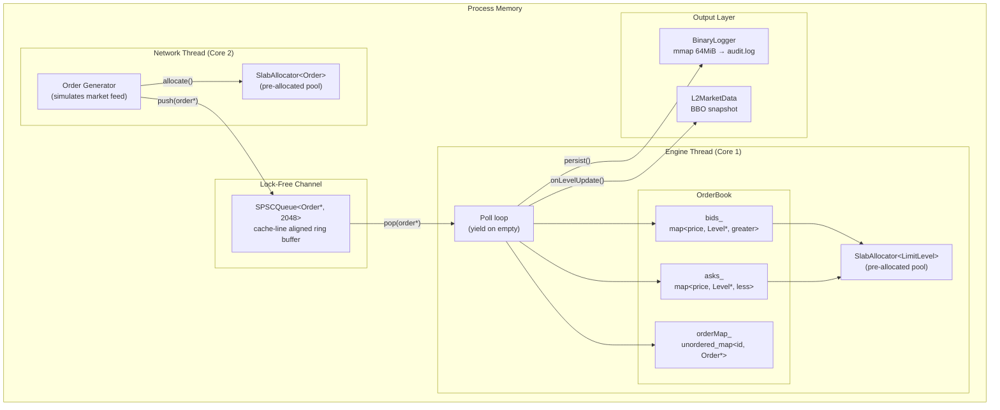
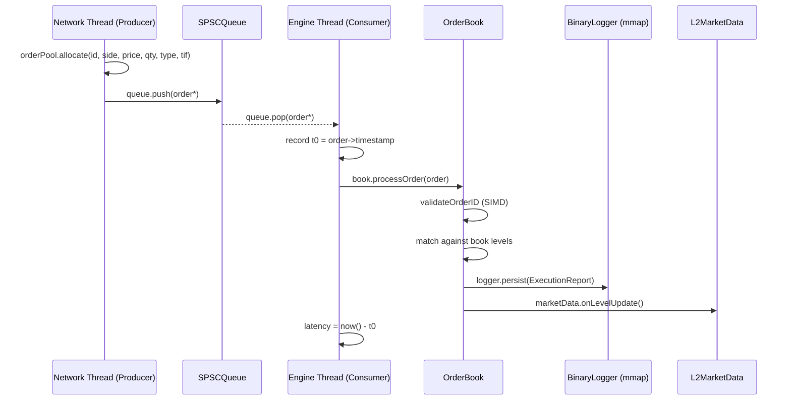

# Aura-Trade — Low-Latency Matching Engine

[](https://en.cppreference.com/w/cpp/20)
[](https://opensource.org/licenses/MIT)

A production-grade, sub-microsecond Limit Order Book (LOB) matching engine written in C++20. Designed for high-frequency trading (HFT) and low-latency SDK demonstration.

## 🚀 Quick Start

### Build
Requires: g++ ≥ 12, C++20, POSIX (Linux or macOS).
```bash
make          # Produces the ./matching_engine binary
```

### Run Benchmark
```bash
./matching_engine
```

### Clean
```bash
make clean    # Removes binary and audit logs
```

---

## 🏗️ Architecture & Technical Walkthrough

Aura-Trade is designed with a **mechanical sympathy** approach, ensuring the software respects the underlying CPU cache and memory hierarchy.

### System Flow


### Order Lifecycle


---

## 🛠️ Key Design Decisions

| Challenge | Engineering Solution | Files Involved |
| :--- | :--- | :--- |
| **Zero Allocation** | Lock-free `SlabAllocator` for `Order` and `LimitLevel` objects. | `SlabAllocator.hpp` |
| **Inter-thread Jitter** | `SPSCQueue` with indexes aligned to separate 64-byte cache lines. | `SPSCQueue.hpp` |
| **O(1) Cancellation** | Intrusive doubly-linked list within each `LimitLevel` for instant splice. | `OrderBook.hpp` |
| **Durability Jitter** | `BinaryLogger` uses `mmap` for `memcpy`-speed persistence. | `BinaryLogger.hpp` |
| **Context Switches** | `AffinityManager` pins threads to physical CPU cores. | `CoreAffinity.hpp` |
| **SOLID Architecture** | Decoupled Persistence and Market Data via Interface Injection. | `Interfaces.hpp` |

---

## 📂 Project Structure

```
include/AuraTrade/
├── Types.hpp           # Order, LimitLevel, ExecutionReport, enums
├── SlabAllocator.hpp   # Pre-allocated pools (zero hot-path allocation)
├── SPSCQueue.hpp       # Lock-free ring buffer for network-to-engine handoff
├── Interfaces.hpp      # IMarketDataHandler, IPersistenceHandler
├── OrderBook.hpp       # Price-time priority matching engine
├── BinaryLogger.hpp    # Memory-mapped binary audit log
├── MarketData.hpp      # L2 best-bid/offer snapshot generator
├── CoreAffinity.hpp    # CPU thread pinning (Linux & macOS)
└── SIMDValidator.hpp   # Hardware-accelerated order-ID range checking
main.cpp                # Performance benchmark driver
Makefile                # High-performance compiler flags (-O3, -march=native)
```

---

## 📈 Performance Characteristics

| Metric | Complexity | Rationale |
| :--- | :--- | :--- |
| **Matching** | **O(L)** | L = number of price levels crossed. Book walk is purely sequential. |
| **Cancellation** | **O(1)** | Direct pointer access via `orderMap` + DLL removal. |
| **Insertion** | **O(log P)** | P = price levels in the book (using `std::map`). |
| **Allocation** | **O(1)** | Constant time acquisition from the pre-allocated pool. |

---

## 🔍 Advanced Feature Deep-Dive

### Memory Management (Mechanical Sympathy)
The `SlabAllocator` eliminates the non-deterministic latency of `malloc`. At startup, 500,000 Order objects are claimed. During the "hot path", we simply flip a pointer in a lock-free CAS loop.

### Persistence (AEP Design)
Traditional file I/O involves system calls (`write()`) that pause the CPU and flush kernel buffers. Aura-Trade uses **Memory Mapped Files (`mmap`)**, treating disk space like RAM. Writing a trade record is as fast as a `std::memcpy`.

---

## 📚 Glossary

*   **BBO**: Best Bid and Offer — the "top" of the market.
*   **Tick-to-Trade**: End-to-end latency from order receipt to execution report.
*   **Mechanical Sympathy**: Designing software to work *with* the hardware, not against it.
*   **False Sharing**: Performance degradation where CPUs fight over the same cache line.

---

### License
Distributed under the MIT License. See `LICENSE` for more information.
